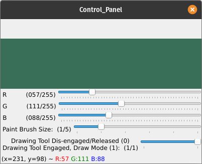
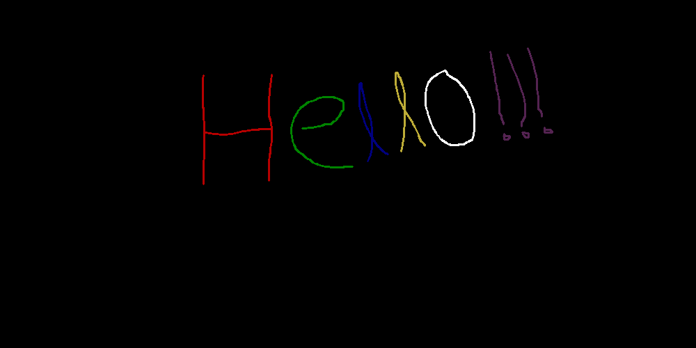

--------------------------------------------------
# DrawBoard: A Digital Balckboard (like Google Jamboard but much simpler) [OpenCV Project]
----------------------------------------------

----------------------------------------
## Project Goal

The goal is to utilize the OpenCV HighGUI module to create an application similar to Google Jamboard or Microsoft Paint. A window will be created where you can draw anything. You can choose which color to draw with (using a RGB color mixer window) and you can also define the brush size (i.e, drawing tool width) using a trackbar. 

-----------------------------------------------

## Current Status, Usage, and Project Description

### Caution !!!

This is a simple application built using OpenCV. The OpenCV library is not meant for developing such GUI applications and can use up significant resources. There are other libraries which are built specifically for developing such applications. If you need something fancy look elsewhere. If you need something very simple and just want to have fun you can use this one. Have Fun !!! 

### Usage
Run the `drawboard.py` file to launch the application. The Blackboard GUI will be displayed along with the Control panel window and the Instructions window.

### Some screenshots of the program

- Instructions window

- Control panel window

- DrawBoard GUI

### Future prospect
1. Add fullscreen mode.
2. Add an eraser (width can be controlled by the brush size control trackbar).
3. Show warnings when brush size is set to 0 and user tries to draw or when the draw tool is released and user tries to draw without engaging it first etc.
4. Add undo option (maybe for last 3 strokes).
-----------------------------------------------------
